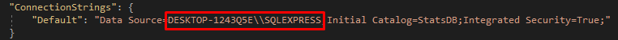

#  TopStats App MVC
В репозитории находится приложение, которое позволяет посмотреть статистику последних 10 игр у 15 лучших игроков.

### How to use it

1. Изменить путь подключения к базе данных на свой в файле 'appsettings.json': 

2. Выполнить миграцию, введя в консоль диспетчера пакетов 'update-database'
3. Данные с файла 'playersData.json' загрузятся в базу данных, при первом запуске приложения 

